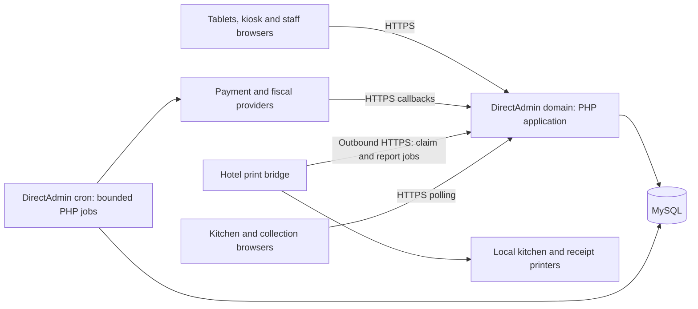

# System architecture

Status: PHP with Laravel, HTML/CSS/JavaScript, MySQL, and DirectAdmin are confirmed (C19–C21, C23, C25). Supporting design choices D16/D17 remain proposed. One hotel per isolated installation.

## DirectAdmin hosting model

Deploy one modular Laravel/PHP application and its MySQL database to a DirectAdmin hosting account. Customer and staff browsers reach the hotel's HTTPS domain over the internet. The public document root contains only the web entry point and approved public assets; application logic, configuration, dependencies, logs, and original uploads stay outside it. See the [DirectAdmin layout](05-directadmin-layout.md) and [technology fact file](../TECHNOLOGY-FACT-FILE.md).

The hosting account is authoritative. The hotel print bridge has narrowly scoped credentials and only connects outward to the hosted API; printers and the hotel LAN are not exposed to the internet. No separate payment callback relay is needed by default because the PHP application already has a public HTTPS endpoint.

## Technical baseline

| Layer | Choice | Status / boundary |
|---|---|---|
| Browser UI | HTML, CSS, plain JavaScript | Confirmed C20; native modules proposed |
| Backend | PHP with Laravel | Confirmed C19/C25; modular domain structure, Composer and MySQL/PDO access under D16 |
| Database | MySQL | Confirmed C21; InnoDB transactions and constraints proposed D16 |
| Hosting | DirectAdmin | Confirmed C23; ordinary shared-host limits assumed until provider evidence |
| Updates | Short authenticated JSON polling with cursors | Proposed D17; no persistent SSE/WebSocket server required |
| Background work | MySQL inbox/outbox plus bounded PHP cron runs | Proposed D17; no always-running queue daemon required |
| Files | Public derived media; private originals/configuration | Layout and access verified on selected host |
| Printing | Hotel-side bridge polling hosted jobs | Hardware/agent selection remains a pilot gate |
| Payments/fiscal | Server-side PHP adapters and callback routes | Existing provider validation gates apply |

The plan does not depend on root access, Docker, Redis, a Node.js application server, or custom web-server installation. Host-provided PHP handlers and web-server configuration are validated rather than prescribed. Exact versions, cron frequency, resource limits, and extensions are recorded in M1.

## Request and job boundaries

PHP authenticates the principal and validates scope, prices, availability, balances, and commands. MySQL commits records and outbox work atomically. Polling reads committed event data directly, so kitchen updates do not wait for cron. External requests run only after transaction commit. A bounded immediate attempt may initiate an M-PESA prompt; uncertain outcomes remain pending for safe reconciliation. Cron handles retry and recovery with leases, time limits, and overlap protection.

Public callbacks are narrowly routed and provider-verified; receiving a notification alone cannot settle a bill. Print bridge claims and results use dedicated service authorization. Kitchen sees only released work; collection screens receive redacted projections.

## Installation isolation and availability

Prefer a separate DirectAdmin account per hotel; at minimum each authorized isolated installation has its own document root, private application directory, database/user, secrets, media, and backups. No shared hotel data model or cross-hotel portal is introduced.

The previous on-site hub recommendation D05 is superseded by C23. Internet, DNS, HTTPS, and host availability are now part of ordering availability. Cached menus/drafts cannot authorize offline orders or payments. Manual incident procedures cover outages; a future offline local server would require a separate architecture decision.
