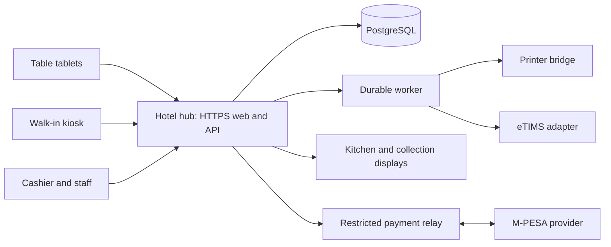

# System architecture

Status: proposed defaults D05/D14. One hotel per installation; not a shared multi-hotel application.

## Recommended shape

Use a modular monolith on an on-site hub: one backend application owns restaurant transactions, with clearly separated domain modules. PostgreSQL is the authority. Serve the customer/staff web application and published media locally over HTTPS. Use a worker for provider delivery, printing, and fiscal requests backed by durable database queues.

Arrows indicate information flow, not unrestricted network access. The payment relay has no customer ordering endpoint and cannot browse the full hotel database. The hub can make outbound authenticated connections to retrieve verified events; no general-purpose inbound access to the hotel's LAN is required.

## Technical baseline

| Layer | Proposed choice | Reason |
|---|---|---|
| Customer/staff UI | React, TypeScript, Vite | Shared component system across device modes; static local serving |
| API | Fastify, TypeScript, JSON Schema contracts | Validated requests/responses with clear module boundaries |
| Persistence | PostgreSQL | Transactions, constraints, locking, auditable financial history |
| Live updates | Server-sent events; HTTP commands | One-way scoped updates; commands remain ordinary authenticated requests |
| Background work | Database inbox/outbox and worker | Avoids adding a second broker before workload requires it |
| Media | Local files/object interface plus off-device backup | Photographs remain usable without external internet |
| Printing | Restricted local bridge using tested hardware adapter | Explicit receipt/ticket jobs instead of browser print dialogs |
| External payments | One provider adapter initially | Prevents conflicting double integrations |

Exact compatible supported versions are selected and pinned in milestone M1. Do not install packages labelled 'latest' automatically in production. These choices are recommendations, not performance measurements. Official references are in [sources](../research/sources.md).

## Runtime boundaries

Frontend never talks directly to the database or carries provider secrets. API validates device/guest/staff scope and owns all money calculations. Worker handles side effects after transactional commits. Kitchen reads only released preparation work. Collection display receives a redacted public projection.

For callback providers, validate using that provider's actual authentication/verification mechanism. Do not assume Safaricom callbacks use Paystack's signature scheme. Unverifiable notifications are stored as pending evidence for server-side query/reconciliation, not treated as payments.

## Installation isolation

Each hotel has separate database, storage, keys, device registrations, backups, and merchant configuration. The same software release may serve different installations; hotel-specific settings and photographs are data, not code forks. A unique installation ID namespaces jobs and relay credentials. No cross-hotel reporting or master commercial portal is in scope.

## Trade-offs

Local operation adds hardware care, TLS/certificate management, backup responsibilities, and remote-update complexity. A cloud-only deployment would simplify some operations but would not meet the proposed local-ordering continuity target without additional design. Validate the local hub approach in a physical pilot before finalising hardware.
